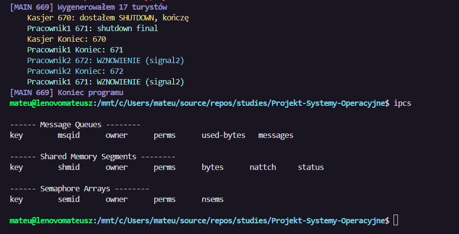

# Kolej linowa - symulacja procesow i IPC

Symulacja dzialania kolei krzeselkowej w sezonie letnim. Program odwzorowuje turystow (piesi i rowerzysci), sprzedaz biletow i karnetow, bramki stacji, peron z doborem skladu krzeselek, zatrzymanie i wznowienie kolei oraz raport z przejazdow.

## 1. Srodowisko i narzedzia

- Jezyk: C
- Kompilator: GCC
- Budowanie: GNU Make
- Edytor: VS Code

## 2. Budowanie i uruchomienie

Budowanie:

```
make
```

Uruchomienie (argumenty: Tp, Tk, opcjonalnie stop_once):

```
./projekt <Tp> <Tk> [stop_once]
```

Przyklad:

```
./projekt 0 10
```

Parametr `stop_once`:
- `1` - po 5 sekundach symulacji wysylany jest STOP i nastepnie WZNOWIENIE.
- `0` lub brak - brak wymuszonego zatrzymania.

## 3. Pokrycie wymagan (skrot)

- Krzeselka 4-osobowe, 72 sztuki, max 36 zajetych naraz.
- Dopuszczalne sklady: 2 rowerzystow, albo 1 rowerzysta + 2 pieszych, albo 4 pieszych.
- Losowe przyjscia, czesc turystow moze zrezygnowac.
- Sprzedaz biletow/karnetow w kasie.
- Karnety: jednorazowe, czasowe (Tk1/Tk2/Tk3), dzienne.
- Znizka 25% dla wieku <10 i >65.
- Dzieci <8 pod opieka doroslego; dorosly max 2 dzieci (4-8).
- Bramki dolne: 4 rownolegle.
- Bramki peronu: 3 rownolegle, otwierane przez pracownika1.
- Limit N osob w strefie miedzy bramkami.
- Wyjscie na gorze: 2 rownolegle pasy.
- Pracownik1 i Pracownik2, STOP/WZNOWIENIE sygnalami.
- Trasy zjazdowe T1 < T2 < T3.
- Godziny pracy Tp..Tk, po Tk brak wejsc na bramkach, peron sie oproznia, po 3 s koniec.
- Logowanie uzyc karnetu na bramkach.
- VIP (~1%) bez kolejki, ale z waznym karnetem.
- Raport z liczby przejazdow na koniec.

## 4. Struktura kodu i odpowiedzialnosci

### `src/main.c`
- Parsuje Tp/Tk (i stop_once), sprawdza zakres, ustawia czas startu.
- Tworzy kolejki, semafory (bramki 4/3, limit N, 36 krzesel, 2 wyjscia, mutex shm) i pamiec dzielona dla kolei; wrzuca identyfikatory do env dla potomnych.
- Inicjalizuje stan kolei w shm (ring 72 krzesel, liczniki, pid pracownikow).
- Czyści `report.txt` na starcie.
- Uruchamia procesy: kasjer, pracownik1, pracownik2, generator turystow (spawn w petli przez Tp..Tk).
- Po Tk wysyla sygnal zamkniecia peronu, czeka az kolej sie oprozni, sleep 3 s, wysyla shutdown do kasjera/peronu, zabija employee2, czeka na dzieci, generuje podsumowanie w `report.txt`, sprzata IPC.

### `src/cashier.c`
- Slucha kolejki biletowej; kazdy request ma pid, wiek, VIP, rowerzysta, liczbe biletow (w tym ulgowych).
- Losuje typ karnetu (lub honoruje podany), nalicza znizke 25% dla <10 i >65, ustawia `issued_at` i `valid_until` (Tk1/Tk2/Tk3/dzienny -> Tk).
- Po uplywie Tk odrzuca sprzedaz (status != ST_OK).
- Odsyla wynik do pid turysty przez msgrcv/msgrcv z mtype=pid.

### `src/employee1.c`
- Ustawia w shm swoje pid, czeka na pid pracownika2.
- Obsluguje kolejke peronu: odbiera z `platform_qid` z priorytetem VIP (msgrcv na ujemny mtype), wpuszcza tylko do Tk lub odrzuca po zamknieciu.
- Kolejkuje rowerzystow i grupy pieszych (max 3 osoby: dorosly+2 dzieci) i probuje formowac sklady krzeselek: 2 rowery; 1 rower + 2 pieszych; 4 pieszych. Przy rezerwacji zajmuje semafor krzeselek (36) i wpisuje pids do ringu w shm.
- Sygnaly: SIGUSR1 zatrzymuje formowanie grup, SIGUSR2 wznawia; tryb `stop_once=1` po 5 s wysyla STOP, po ~9 s WZNOWIENIE.
- Na zamkniecie (PLAT_SHUTDOWN) fluszuje oczekujacych z odmowa i konczy.

### `src/employee2.c`
- Ustawia w shm swoje pid, czeka na pid pracownika1.
- Reaguje na SIGUSR1 (STOP) i SIGUSR2 (WZNOWIENIE); przyjmuje handshake i wysyla potwierdzenie do drugiego pracownika.
- Symuluje przejazd krzesel: co 2 s zdejmuje jedno krzeselko z ringu (head++), zwalnia semafor krzeselek, az do zatrzymania.

### `src/tourist.c`
- 20% turystow rezygnuje od razu.
- Tworzy ewentualne dzieci (dodatkowe bilety ulgowe, max 2, wtedy turysta nie jest rowerzysta).
- Wysyla prosbe do kasjera (kolejka msg), czeka na odp. z pass_id i `valid_until`.
- Etapy: dolne bramki (semafory: limit N i 4 bramki, log do `report.txt`), peron (wysylka prosby, priorytet VIP, po akceptacji log, zwolnienie limitu N), wyjazd u gory (semafor 2 pasy, log).
- Petla przejazdow: jednorazowy konczy po 1, czasowe/dzienne jezdza do `valid_until` lub Tk.

### `src/ipc.c`
- Wrappery na msgget/msgsnd/msgrcv/msgctl, semget/semctl/semop (wait/post), shmget/shmat/shmdt/shmctl, plus helpery do env.

### `src/platform_queue.c`
- Bufory na oczekujacych: rowerzysci osobno, piesi z rozmiarem grupy (1-3).
- Algorytm doboru: najpierw 2 rowery; potem 1 rower + suma pieszych =2; potem suma pieszych =4. Rezerwacja krzeselka (semafory krzesel/mutex shm), wpisy pidow do ringu, odpowiedzi PLAT_RES do kazdego pid.

### `src/utils/cablecar_utils.c`
- Ustawia tail/head/occupied=0, czysci 72 sloty siedzen i pids, zeruje pid pracownikow.

### `src/utils/tourist_utils.c`
- Bramki dolne: sprawdza Tk/valid_until, rezerwuje semaforem limit N (liczy dzieci), semafor 4 bramek, loguje do `report.txt`.
- Peron: wysyla PLAT_REQ, czeka na odp., loguje wejscie, zwalnia limit N po przejsciu.
- Wyjscie gorne: semafor 2 pasow wyjscia, loguje, dla rowerzystow dodaje czas zjazdu T1/T2/T3.

### `src/utils/main_utils.c`
- Pomocnicze set_env dla semaforow/liczb, cleanup zasobow IPC.
- `generate_report`: czyta `report.txt`, zlicza wjazdy na peron (`gate=platform`) per pass_id i dopisuje podsumowanie na koniec pliku.

### `include/*.h`
- Struktury, stale, prototypy funkcji, klucze IPC i zmienne srodowiskowe.

## 5. Jak to dziala (opis mechaniki)

### IPC
- Kolejki komunikatow: turysta <-> kasjer, turysta <-> peron.
- Semafory: limit N osob, bramki (4 i 3), krzeselka (36), wyjscia (2), dostep do shm.
- Pamiec dzielona: stan kolei (ring krzeselek, liczniki, pid pracownikow).

### Kolejka i krzeselka
- Peron sklada grupy w zgodzie z zasadami (piesi/rowerzysci, dzieci).
- Krzeselka trzymane w ringu o dlugosci 72, z limitem 36 jednoczesnie zajetych.

### Czas i wygasanie karnetow
- Tp i Tk sa parametrami uruchomienia.
- Karnety czasowe: `valid_until = issued_at + TkX`.
- Karnet dzienny: `valid_until = Tk`.
- Turysta jezdzi w petli do przekroczenia `valid_until`.

### STOP/WZNOWIENIE
- STOP (SIGUSR1) wysylany do drugiego pracownika.
- Odpowiedz WZNOWIENIE (SIGUSR2) po potwierdzeniu gotowosci.
- `stop_once` wymusza pojedyncze zatrzymanie po 5 sekundach.

## 6. Logi i raport

- `report.txt` zawiera pelny log przejsc przez bramki (pass_id + czas + gate).
- Na koncu pliku dopisywane jest podsumowanie liczby przejazdow na karnet (gate=platform).

## 7. Testy

Testy wykonywane recznie w WSL, build przez `make`.

- Czy program nigdy nie usadzi na jednym krzesełku więcej osób niż pozwalają zasady?
Nie, jest to obsłużone w funkcji:
 [platform_try_form_groups – linie 122-171](src/platform_queue.c#L122-L171).
 

- Czy kolej natychmiast zatrzymuje ruch krzesełek, nie wpuszcza nowych osób na peron?
Tak, pracownicy komunikują się pomiędzy sobą oraz natychmiast zatrzymują ruch koleji(po 9sek go wznawiają):
 [employee1 – linie 18-79](src/employee1.c#L18-L79) oraz [employee2 – linie 10-73](src/employee2.c#L10-L73).


- Czy VIPy przechodzą do bramek przed zwykłą kolejką?
Tak:
 [employee1 – linie 123-139](src/employee1.c#L123-L139).


- Czy pracownicy wstrzymają wpuszczanie ludzi jeżeli na koleji bedzie 36 osob?
Tak, jest to obsłużone za pomocą semafora który nie dopuszcza do sytuacji by na koleji bylo wiecej niz 36 osob:
 [reserve_seat – linie 108-118](src/platform_queue.c#L108-L118), zwolnienie przy zjeździe w [employee2 – linie 100-111](src/employee2.c#L100-L111), semafor inicjalizowany na 36 w [main – linie 51-67](src/main.c#L51-L67).

- Czy program poprawnie zakończył działanie, czy nie pozostawił żadnych procesów zombie i czy wątki/procesy są zakończone?
Sprzątanie IPC po zakończeniu: `cleanup_ipc` usuwa kolejki/semafory/shm [main_utils.c – linie 27-41](src/utils/main_utils.c#L27-L41), wywołanie na końcu `main` po wygenerowaniu raportu.
Jak widać na zdjęciu, brak jakichkolwiek procesów zombie:


## 8. Funkcje wymagane przez projekt (przyklady uzycia)

- Tworzenie procesow:
  - [fork() – linia 10](src/utils/process_utils.c#L10)
  - [execl() – linia 15](src/utils/process_utils.c#L15)
  - [waitpid() – linia 74](src/utils/process_utils.c#L74)
- Obsluga sygnalow:
  - [kill() – linia 69](src/employee1.c#L69)
  - [signal() – linia 45](src/employee2.c#L45)
- Kolejki komunikatow:
  - [msgget() – linia 20](src/ipc.c#L20)
  - [msgsnd() – linia 134](src/ipc.c#L134)
  - [msgrcv() – linia 143](src/ipc.c#L143)
  - [msgctl() – linia 57](src/ipc.c#L57)
- Semafory:
  - [semget() – linia 66](src/ipc.c#L66)
  - [semctl() – linia 73](src/ipc.c#L73)
  - [semop() – linia 112](src/ipc.c#L112)
- Pamiec dzielona:
  - [shmget() – linia 171](src/ipc.c#L171)
  - [shmat() – linia 180](src/ipc.c#L180)
  - [shmdt() – linia 189](src/ipc.c#L189)
  - [shmctl() – linia 197](src/ipc.c#L197)
- Pliki (logi/raport):
  - [fopen() – linia 12](src/utils/tourist_utils.c#L12)
  - [fclose() – linia 26](src/utils/tourist_utils.c#L26)
  - [fprintf() – linia 84](src/utils/main_utils.c#L84)
